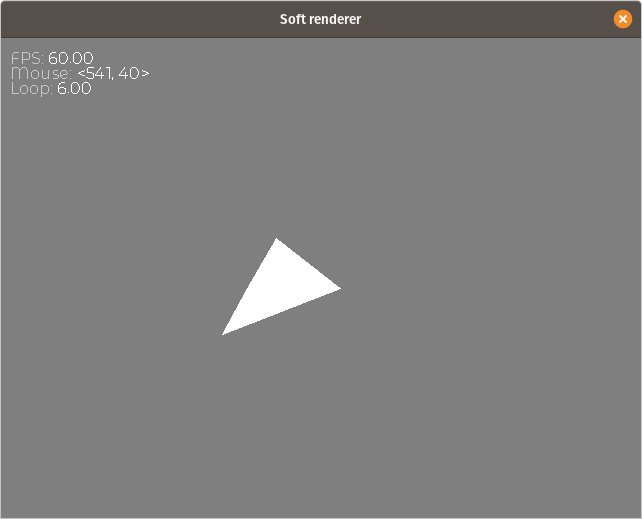
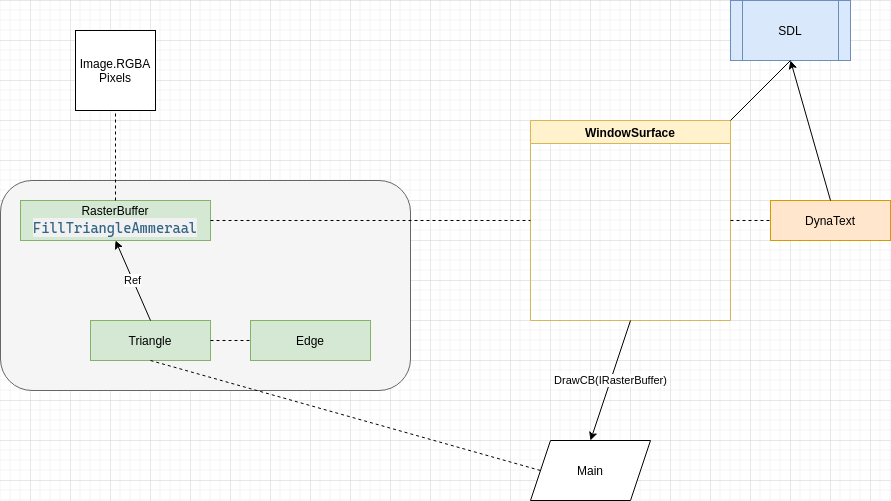

# SimpleTriangleRasterizer-Go
A simple Bresenham triangle rasterizer that references on Ammeraal's graphics book and uses SDL for the window.



# 2024-03-01
Something is broken with ttf fonts and SDL2. So I now have to statically compile it:
```sh
CGO_ENABLED=1 CC=gcc GOOS=linux GOARCH=amd64 go build -tags static -ldflags "-s -w"
```

This rasterizer renders a *single* triangle. It does not support shared edges based on Polygons. However, adding that feature is simply a matter of adding a Polygon class that tracks inside and outside edges. If you are considering using this for FPGAs then you will need to think about graphic pipelines and perhaps consider the Barycentric algorithm as well (see reference #1).

This rasterizer supports Translucency and Overdraw. It is based on the Top-Left algorithm. However, because this code only renders independent triangles it does draw the *right* side edges, but it doesn't draw the **Top**'s bottom edge which saves on overdraw at the X intercept.

# Code
Even in Go there is a large chunk of code needed just to provide an output for the rasterization. A majority of the code is simply just to construct and manage the window, **SDL** and render loop.

The main rasterizing code is contained in the Green boxes:
- RasterBuffer  <-- Pixel and line draw
- Triangle <-- sets up edges
- Edge



# Pipeline
The rasterizer can be optimized by converting it into a pipeline where each vertex is transformed from local-space to world-space and then mapped to pixel-space. Pixel-space is where the rasterizer does it work.

# References
1) [sunshine2k](http://www.sunshine2k.de/coding/java/TriangleRasterization/TriangleRasterization.html) specifics for scanline rasterization. It also covers the Barycentric Algorithm as well.
2) [Ammeraal's book](https://smile.amazon.com/Computer-Graphics-Java-Programmers-Ammeraal/dp/0470031603/ref=sr_1_1?dchild=1&keywords=leen+ammeraal+graphics&qid=1625413592&sr=8-1) specifics for line drawing.
